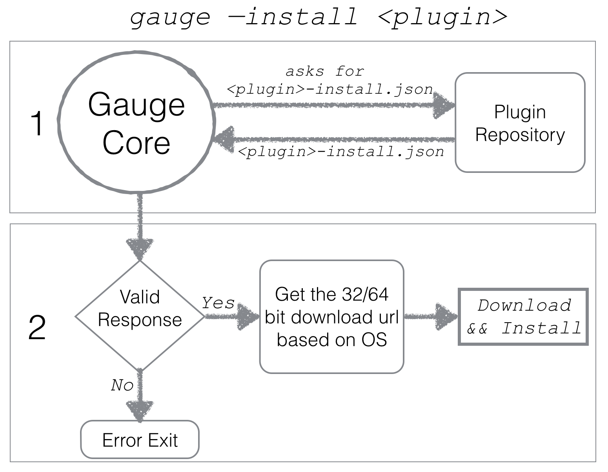

# Deployment

#### Target Machine
The language runners are installed at the below locations
 - *nix platforms  - `~/.gauge`
 - Windows - `%appdata%\gauge`

#### Installation

Gauge Language and Reporting plugins can be installed via

    gauge --install <plugin_name>

The plugins are installed under a versioned directory, which allows one target machine to have multiple versions of the same plugin installed. Gauge would pick the highest version compatible with the current Gauge version.



Gauge does following things, when `gauge --install <plugin>` is run
1. Gauge asks Plugin Repository to give `<plugin>-install.json`.
2. Receives a Response from Plugin Repository.
    - Receives a valid `json`,finds the download url from `json` based on OS
        - Download the Plugin.
        - Install the plugin in Gauge plugin directory.
    - Receives an Invalid response
        - Shows error message and exit.

The `--install` flag also has a `-f` flag which can point to a local copy of the plugin zip archive. This will not query the Repository for location of the plugin archive.

*The IDE plugin installation is dependent on IDE ecosystem.*

#### Setting up repository

Gauge and its plugins are deployed as Github Releases. Each release has an archive containing the binaries for the plugin/ gauge.

Gauge-Repository contains metadata for version compatibility. Every plugin in Gauge ecosystem needs to have a `json` file with the below format:

```
{
    "name": <plugin name>,
    "description": <plugin description>,
    "versions": [
        {
            "version": <plugin version>,
            "gaugeVersionSupport": {
                "minimum": <minimum gauge version>,
                "maximum": <maximum gauge version, empty string for latest>
            },

            "install": {
                "windows": <array of commands to install on windows, empty array if none>,
                "linux": <array of commands to install on linux, empty array if none>,
                "darwin": <array of commands to install on darwin, empty array if none>
            },

            "DownloadUrls": {
                "x86": {
                    "windows": <windows_archive_path>,
                    "linux": <linux_archive_path>,
                    "darwin": <darwin_archive_path>
                },
                "x64": {
                    "windows": <windows_x64_archive_path>,
                    "linux": <linux_x64_archive_path>,
                    "darwin": <darwin_x64_archive_path>
                }
            }
        }
    }]
}
```
