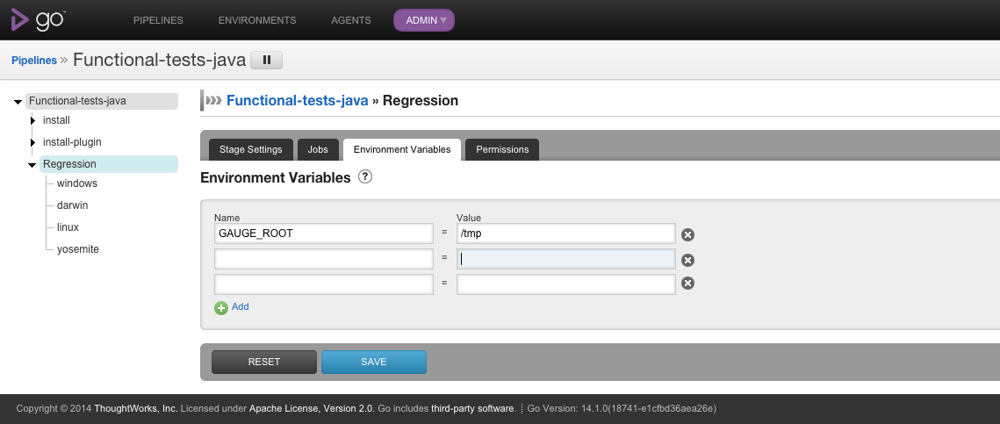
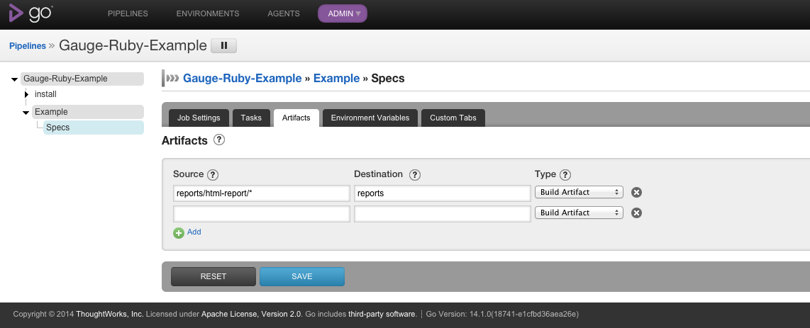
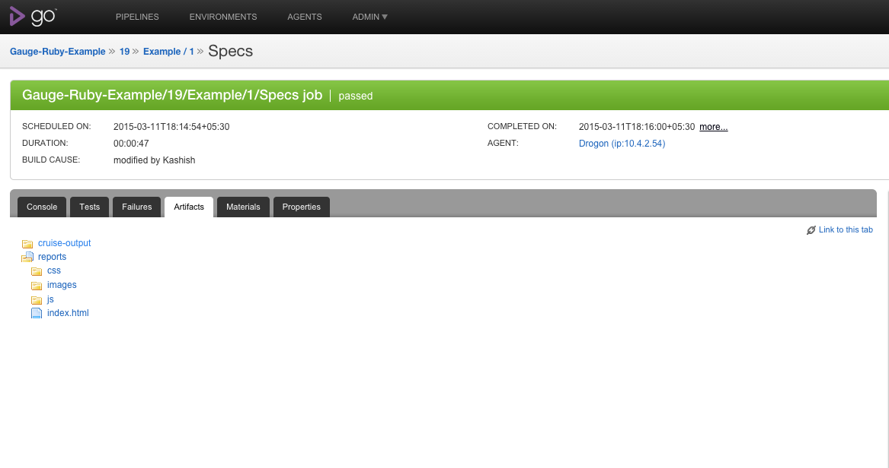
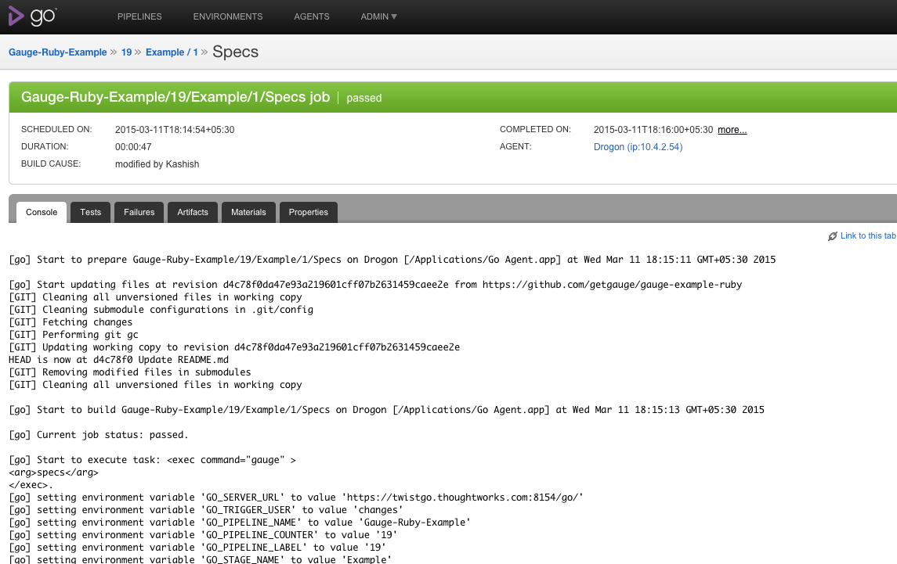
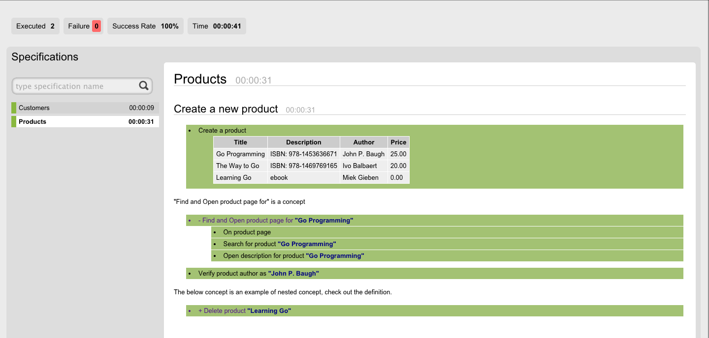

# Go
[Go](http://www.go.cd/), a tool which supports Continuous Integration, can be integrated with Gauge.

Steps to integrate Gauge with Go:

* [Setup a new pipeline on Go](http://www.go.cd/documentation/user/current/configuration/quick_pipeline_setup.html)

    
* [Download](http://getgauge.io/download.html) and Install Gauge on the Go Agent

Following steps will help **setting up the environment for Gauge** :

* If you want to run specific instance of gauge on Go, set `GAUGE_ROOT` in environment variable tab to the path of specific instance.

    

* Create a new task which will run `gauge specs`. If you want to run only a subset of specs, you can use [tags](../../flags/README.md). Adding a flag `-p` runs them in [parallel](../../execution/parallel_execution.md).

    Another understood parameter is env. This lets you run your tests against `Staging`, or `QA`. You can also use this to decide which browser to execute against.

    All the [flags](../../flags/README.md) supported by Gauge can be used here as per the need.

    

* Gauge generates **reports** after execution which can be configured in Go by adding a new artifact in Artifacts tab.

    

* Artifacts can be viewed here. You see the configured Gauge artifact appear here.

    

* **Console output** can be seen while execution of job and reports can be seen after execution.

    

* This is how the output HTML configured looks.

    
